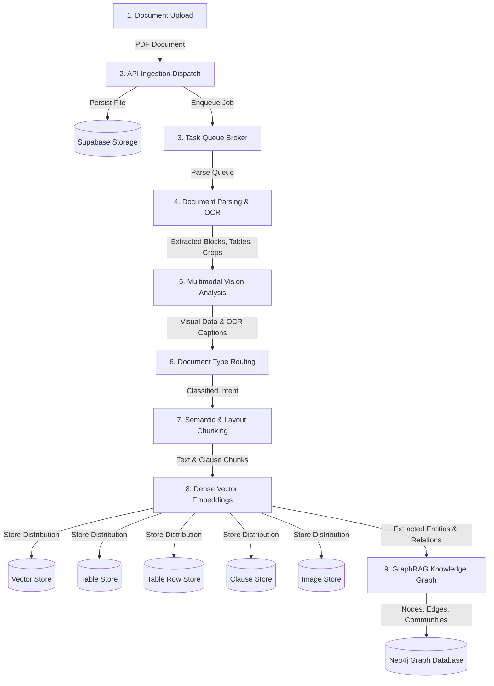
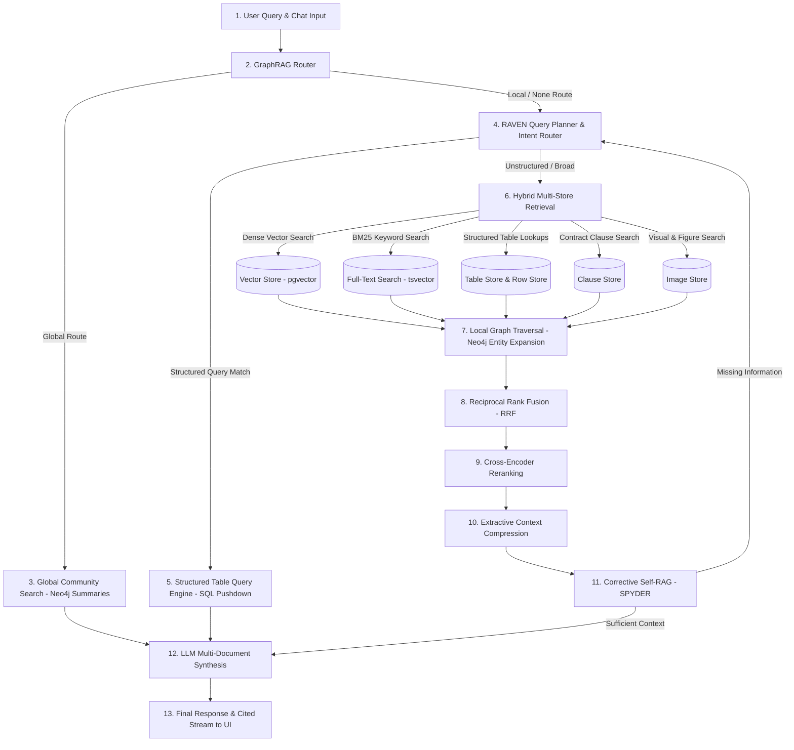

# Enterprise Multi-Store RAG Architecture

This document provides a high-level, step-by-step flowchart and tool mapping for both the **Ingestion Pipeline** and the **Retrieval & Query Pipeline**.

---

## 1. Ingestion Pipeline Architecture (Top to End)

### Ingestion Step-by-Step Tool Mapping

| Step | Stage Name | Tool / Technology Used | Description |
| :--- | :--- | :--- | :--- |
| **1** | **Document Upload** | **Next.js 14 (React / TypeScript)** | Drag-and-drop file upload interface with batch staging and taxonomy tagging. |
| **2** | **API Ingestion Dispatch** | **FastAPI (Python 3.11)** | Receives uploads, generates UUIDs, saves original files to Supabase Storage, and dispatches background tasks. |
| **3** | **Task Queue & Broker** | **Redis + Celery** | Asynchronous message broker that manages dedicated task queues (`parse`, `embed`, `graph`). |
| **4** | **Document Parsing & OCR** | **Docling (IBM Granite Layout Models)** | High-precision PDF layout analysis, bounding box extraction, table structure parsing, and image cropping. |
| **5** | **Multimodal Vision Analysis** | **Groq VLM (`qwen/qwen3.8-27b`)** | Analyzes extracted figures, charts, and table crops with sub-3s visual transcription and structured JSON generation. |
| **6** | **Document Routing** | **Groq LLM (`groq/compound-mini`)** | Classifies documents into specialized domains (Financial, Legal, Technical, Policy, General). |
| **7** | **Semantic & Layout Chunking** | **Custom Python Layout Chunker** | Partitions text along natural section boundaries and regex clause patterns with sub-second performance. |
| **8** | **Dense Vector Embeddings** | **BAAI BGE (`BAAI/bge-large-en-v1.5`)** | Computes 1024-dimensional semantic embeddings on CPU/GPU for chunks and clauses. |
| **9** | **Multi-Store Persistence** | **PostgreSQL (Supabase) + pgvector** | Stores vectors in `vector_store`, macro tables in `table_store`, rows in `table_row_store`, clauses in `clause_store`, and images in `image_store`. |
| **10** | **GraphRAG Entity Extraction** | **Groq NER (`qwen/qwen3.6-27b`) + Neo4j** | Extracts entities and typed relationships, building cross-document knowledge graphs and Leiden community summaries. |

---

## 2. Retrieval & Query Pipeline Architecture (Top to End)

### Retrieval Step-by-Step Tool Mapping

| Step | Stage Name | Tool / Technology Used | Description |
| :--- | :--- | :--- | :--- |
| **1** | **User Query** | **Next.js 14 Frontend** | Conversational UI supporting multi-turn chat, markdown rendering, and interactive citations. |
| **2** | **GraphRAG Router** | **Cosine Centroids / Groq Router** | Determines if query requires global community synthesis, local entity expansion, or standard multi-store retrieval. |
| **3** | **Global Community Search** | **Neo4j Aura (Leiden Communities)** | Directly queries pre-computed hierarchical knowledge graph community summaries for high-level global questions. |
| **4** | **RAVEN Query Planner** | **RAVEN (`groq/compound-mini`)** | Reframes conversational context, decomposes complex queries into sub-intents, and selects optimal store targets. |
| **5** | **Structured Table Query** | **PostgreSQL SQL Engine** | Executes deterministic SQL aggregation/ranking shortcuts on tabular data when exact numerical queries are detected. |
| **6** | **Hybrid Multi-Store Retrieval** | **PostgreSQL (`pgvector` + `tsvector`)** | Runs dense vector search and BM25 full-text keyword search across Vector, Clause, Table, and Image stores in parallel. |
| **7** | **Local Graph Traversal** | **Neo4j Cypher (`2-Hop Expansion`)** | Discovers and pulls entity-linked chunks across connected documents in the knowledge graph. |
| **8** | **Reciprocal Rank Fusion** | **RRF Algorithm ($k=60$)** | Blends, normalizes, and balances candidate pools across semantic, keyword, and graph retrieval streams. |
| **9** | **Cross-Encoder Reranker** | **`cross-encoder/ms-marco-MiniLM-L-6-v2`** | Performs deep query-passage cross-attention scoring to re-order top retrieval candidates. |
| **10** | **Context Compression** | **Extractive Relevance Filter** | Prunes irrelevant sentences from retrieved chunks while preserving verbatim text and citation anchors. |
| **11** | **Corrective Self-RAG** | **SPYDER (`groq/compound`)** | Evaluates retrieval sufficiency and flags missing information to trigger targeted follow-up queries if needed. |
| **12** | **LLM Synthesis** | **Groq LLM (`openai/gpt-oss-120b`)** | Synthesizes complex multi-document answers with verifiable citations (`[Doc: X, Page: Y]`). |
| **13** | **Final Response & Citations** | **Server-Sent Events (SSE) + FastAPI** | Streams generated markdown tokens and interactive citation metadata to the frontend in real time. |

---

## 3. Technology Stack Overview

| Category | Component / Tool |
| :--- | :--- |
| **Frontend** | Next.js 14 (App Router), React, TailwindCSS, Lucide Icons, Poppins Typography |
| **Backend API** | FastAPI, Python 3.11, Pydantic v2, Uvicorn |
| **Background Processing** | Celery 5.4, Redis 7 (Docker) |
| **Document Parsing** | Docling (IBM Granite), EasyOCR (CPU, optional) |
| **Multimodal / Vision AI** | Groq LPU Inference (`qwen/qwen3.8-27b`) |
| **Large Language Models** | Groq (`openai/gpt-oss-120b`, `groq/compound`, `groq/compound-mini`, `qwen/qwen3.6-27b`) |
| **Embeddings & Reranking** | BAAI BGE-Large-EN-v1.5 (1024-dim), Cross-Encoder MS-Marco MiniLM-L-6-v2 |
| **Relational & Vector DB** | PostgreSQL (Supabase) + `pgvector` + `tsvector` |
| **Knowledge Graph DB** | Neo4j Aura (Cypher Query Language) |
| **File Storage** | Supabase Storage (Private S3-compatible buckets) |
