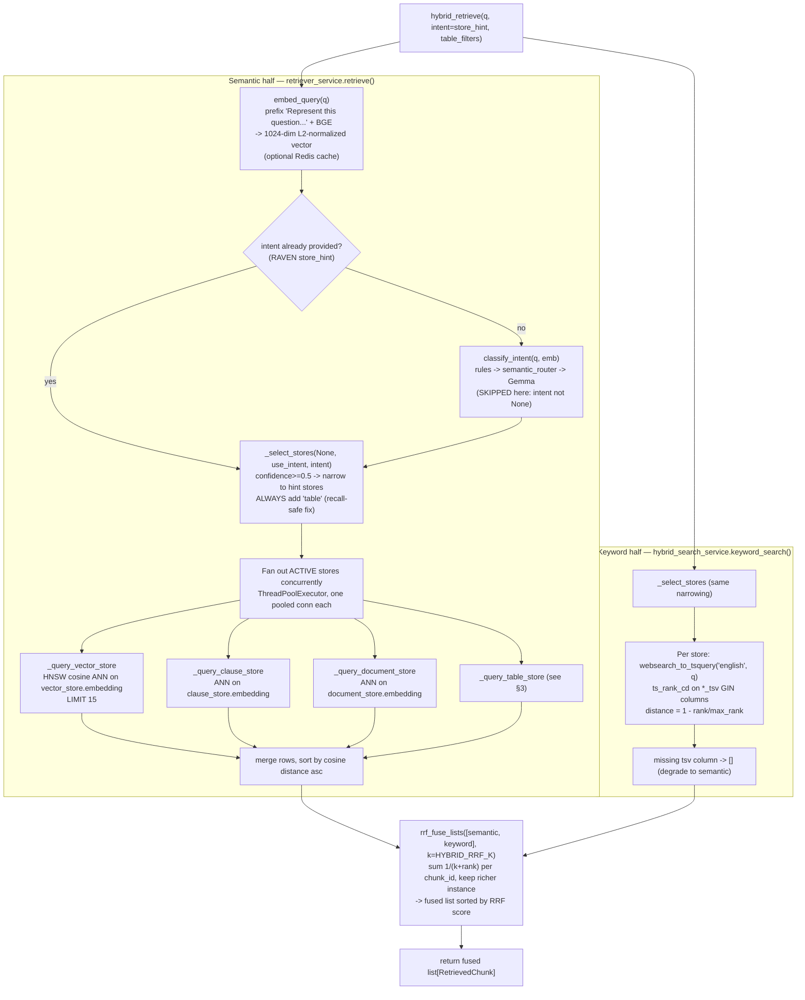
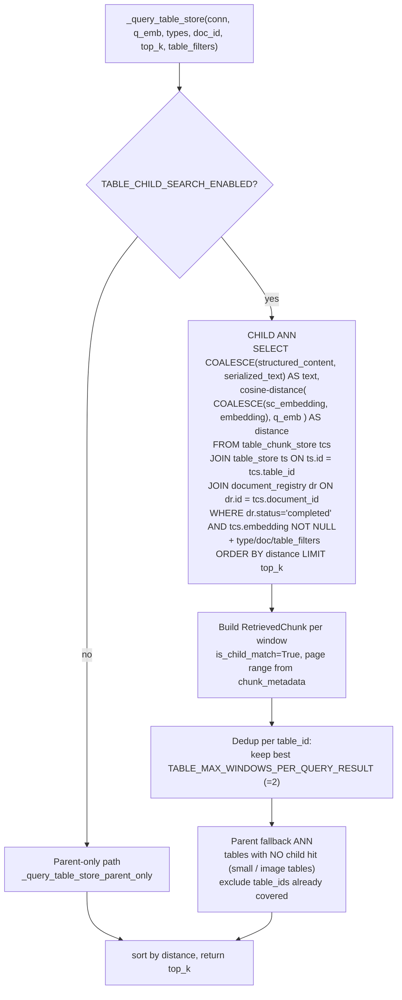
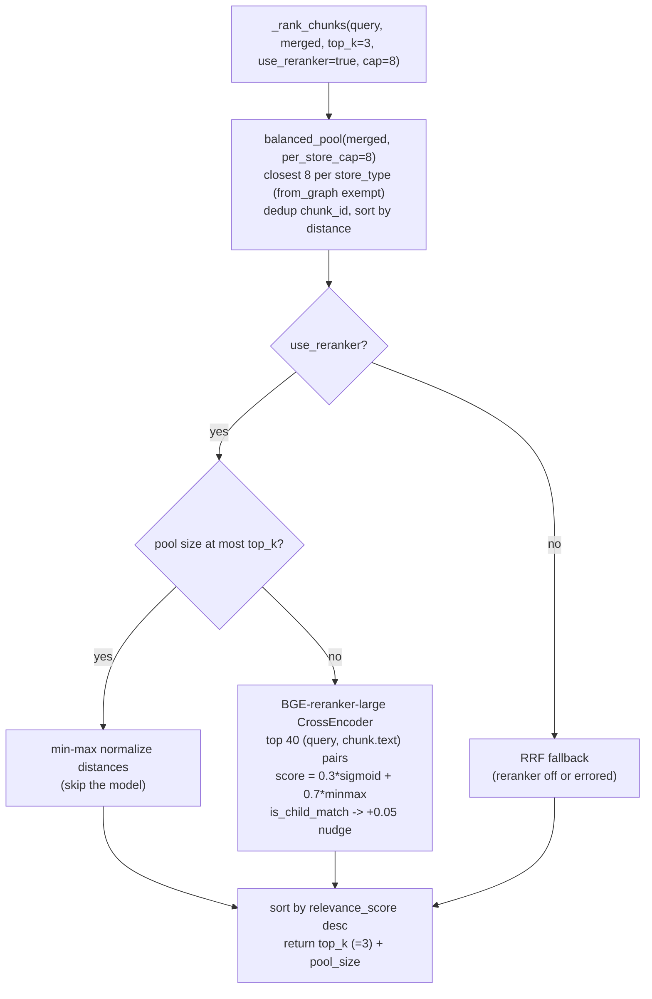
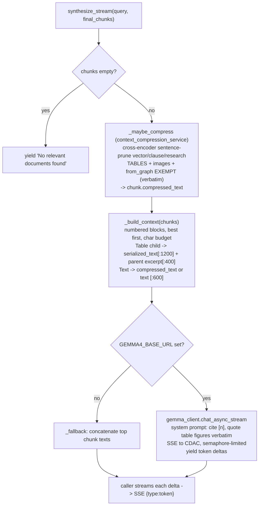

# End-to-End Retrieval Pipeline — Full Low-Level Trace

This document traces **every step** a question takes, from the user's keystroke in
the browser to the rendered answer, exactly as the code runs **today** with the
live configuration:

- `AGENTIC_RAG_ENABLED = true` → the **agentic** path (RAVEN → hybrid loop → SPYDER).
- `HYBRID_IN_CLASSIC_PATH = true`, `HYBRID_SEARCH_ENABLED = true` → semantic + keyword fusion.
- Frontend uses the **streaming** endpoint `/api/v1/query/stream` (SSE).
- `INTENT_USE_LLM = true` (RAVEN emits the store hint; the classic `classify_intent`
  tier is bypassed in the agentic path).
- Table store is **always searched** even when the hint narrows (the fix in
  `_select_stores`).

**Running example** (matches your screenshot):
Query = `what is the nse symbol of the company name "Steel Authority of India"?`
Answer = **SAIL**, Good confidence 63%, 3 chunks, sources **Document + Table**,
`stockmarket.pdf` p.1.

---

## 1. Master flow (all layers)

Each node's label states *what it does*. Node IDs (F1, B3, …) are referenced in the
step-by-step walkthrough in §6.

```mermaid
flowchart TD
    %% ---------------- FRONTEND ----------------
    subgraph FE["Browser — query/page.tsx"]
        F1["User types question and hits send\nabortRef = new AbortController"]
        F2["Build JSON body\nquery, document_types (only if chips selected),\ntop_k = 3, use_reranker = true"]
        F3["fetch POST /api/v1/query/stream\nheaders JSON, signal = abort\nAccept an SSE byte stream"]
        F4{"HTTP status 404?"}
        F5["Fallback: POST /api/v1/query\n(non-stream) parse one JSON"]
        F6["Read SSE reader loop\nsplit on newlines, parse 'data:' lines"]
        F7["event.type routing:\nstatus / stage / synthesis_start / token / done"]
        F8["token -> append to fullText\nsetStreamingText live render"]
        F9["done -> capture confidence,\nconfidence_breakdown, citations,\nretrieval_stats, timings"]
        F10["Build AssistantMessage\nrender answer + confidence bar +\nsource chips; persist to chat session"]
    end

    %% ---------------- PROXY ----------------
    subgraph PX["Next.js proxy — api/v1/query/stream/route.ts"]
        P1["Receive POST from browser"]
        P2["fetch BACKEND/api/v1/query/stream\nforward body, no-store"]
        P3["Pipe upstream body back\nContent-Type text/event-stream"]
    end

    %% ---------------- API ENTRY ----------------
    subgraph API["FastAPI — query.py query_documents_stream"]
        A1["tracing.reset_timings()"]
        A2{"_is_conversational(query)?\ngreeting / at most 2 words no doc-starter"}
        A3["Conversational short-circuit:\nsynthesize_conversational -> stream one token + done"]
        A4{"document_types valid?\nsubset of policy/financial/legal/entity/research"}
        A5["400 Invalid document_types"]
        A6{"AGENTIC_RAG_ENABLED?"}
        A7["_stream_agentic_full generator\nyield heartbeat status 'retrieving'\nregister on_stage callback -> stage_events[]"]
    end

    %% ---------------- AGENTIC ORCHESTRATOR ----------------
    subgraph AG["agentic_pipeline.run()"]
        G0{"GraphRAG enabled AND no document_id\nAND graph_service.is_available()?"}
        G0a["route_graphrag(query)\n-> none | local | global"]
        G0b{"mode == global?"}
        G0c["global_search over community summaries\nRETURN empty chunks + global_answer"]
        G1["RAVEN.reframe(query) — Gemma JSON\nreframed, sub_queries[0..3],\nstore_hint {stores, doc_types, confidence},\nfail-open = raw query"]
        G2["working_query = reframed or query\nintent = store_hint"]
        LOOP["BOUNDED LOOP (up to AGENTIC_MAX_LOOPS)"]
        G3["all_queries = [working_query] + sub_queries"]
        G4["For each q: hybrid_retrieve(q, intent, table_filters)\ndedup by chunk_id -> merged"]
        G5{"graph_mode == local?"}
        G6["graphrag_local_chunks + graph_expanded_chunks\nmark from_graph=True, add to merged"]
        G7["_rank_chunks(working_query, merged, top_k=3)"]
        G8{"SPYDER_ENABLED and loops below max?"}
        G9["SPYDER.judge(working_query, final_chunks)\nsufficient? confidence? reframed_query?"]
        G10{"sufficient OR conf>=min OR no reframe?"}
        G11["working_query = reframed_query\nsub_queries = [] ; loop again"]
        G12["RETURN final_chunks + agentic_stats"]
    end

    %% ---------------- SYNTHESIS + RESPONSE ----------------
    subgraph SY["Streaming synthesis — back in generator"]
        S0["flush queued stage_events as SSE"]
        S1{"final_chunks empty?"}
        S2["stream 'No relevant documents found' + done"]
        S3["citations = _citation_from_chunk[]\nmint signed URLs (pdf#page, image)"]
        S4["synthesize_stream(query, final_chunks)"]
        S5["yield synthesis_start meta\n(model, chunks_used, stores_searched, graph_mode)"]
        S6["stream token deltas -> SSE {type:token}"]
        S7["confidence = mean(relevance_score)\nmethod = chunk_average"]
        S8["done payload: citations, confidence,\nbreakdown, retrieval_stats, timings\nthen data: [DONE]"]
    end

    F1 --> F2 --> F3 --> F4
    F4 -- yes --> F5 --> F9
    F4 -- no --> F6 --> F7
    F7 --> F8
    F7 --> F9
    F8 --> F6
    F9 --> F10

    F3 --> P1 --> P2 --> P3 --> A1
    A1 --> A2
    A2 -- yes --> A3 --> P3
    A2 -- no --> A4
    A4 -- no --> A5
    A4 -- yes --> A6
    A6 -- yes --> A7 --> G0

    G0 -- yes --> G0a --> G0b
    G0b -- yes --> G0c --> S0
    G0b -- no --> G1
    G0 -- no --> G1
    G1 --> G2 --> LOOP --> G3 --> G4 --> G5
    G5 -- yes --> G6 --> G7
    G5 -- no --> G7
    G7 --> G8
    G8 -- no --> G12
    G8 -- yes --> G9 --> G10
    G10 -- no --> G11 --> G3
    G10 -- yes --> G12
    G12 --> S0 --> S1
    S1 -- yes --> S2 --> P3
    S1 -- no --> S3 --> S4 --> S5 --> S6 --> S7 --> S8 --> P3
    P3 --> F6
```

---

## 2. Zoom-in: `hybrid_retrieve(q, intent, table_filters)` (called once per query in the loop)

---

## 3. Zoom-in: `_query_table_store()` — why SAIL is found

**In the example:** the query vector is closest to the window whose
`structured_content` JSON contains `"Steel Authority of India","SAIL"`. That window
comes back as a `store_type="table"`, `is_child_match=True` chunk — this is the
**Table** source chip in the UI.

---

## 4. Zoom-in: `_rank_chunks()` — balanced pool + rerank

The `+0.05` nudge for `is_child_match` keeps the bare-number table window from losing
to prose on wording alone — important because the table rows do not contain the
phrase "NSE symbol", only the value `SAIL`.

---

## 5. Zoom-in: `synthesize_stream()` — context build + Gemma stream

---

## 6. Node-by-node walkthrough (with the SAIL example)

### Frontend (`query/page.tsx`)
- **F1–F2** — You type the question. The page builds the request body:
  `{query: '...Steel Authority of India...', top_k: 3, use_reranker: true}`.
  No document-type chips selected → `document_types` omitted (backend decides stores).
- **F3** — `fetch('/api/v1/query/stream', {method:'POST', signal})`. An
  `AbortController` lets a new question cancel an in-flight one.
- **F4–F5** — If the stream route returns 404 (backend not restarted), it silently
  falls back to the non-streaming `/api/v1/query`. Normally not taken.
- **F6–F8** — Reads the SSE byte stream, splits on newlines, parses each
  `data: {...}` line. `token` events append to `fullText` and re-render live, so you
  see the answer typing out.
- **F9–F10** — The `done` event carries the final `confidence` (0.63 → "Good
  confidence 63%"), `confidence_breakdown` (`chunk_average`, "Average relevance
  across 3 chunk(s)"), `citations` (3), `retrieval_stats.stores_searched`
  (`vector`+`table` → **Document** and **Table** chips). Message is saved to the chat
  session.

### Next.js proxy (`api/v1/query/stream/route.ts`)
- **P1–P3** — Server-side proxy forwards the POST to the FastAPI backend and pipes
  the `text/event-stream` body straight back, so the browser never talks to
  `localhost:8000` directly (avoids CORS).

### API entry (`query.py::query_documents_stream`)
- **A1** — Reset per-request tracing timers.
- **A2–A3** — `_is_conversational`: greetings / ≤2-word non-question queries
  short-circuit to a conversational reply with **no retrieval**. Our query is a real
  question → continue.
- **A4–A5** — Validate any `document_types` against the allowed set. None here.
- **A6–A7** — `AGENTIC_RAG_ENABLED=true` → enter `_stream_agentic_full`. Immediately
  yield a heartbeat `status` event so HTTP 200 + SSE headers flush before the slow
  work starts (prevents the proxy's abort timer from firing). An `on_stage` callback
  collects RAVEN/hybrid/SPYDER progress events.

### Agentic orchestrator (`agentic_pipeline.run`)
- **G0–G0c** — GraphRAG global check. Only runs if the graph is enabled, available,
  and no single `document_id` is pinned. `route_graphrag` classifies the query;
  `global` would answer from community summaries and return early. Our query →
  `none`, so we skip to RAVEN.
- **G1–G2** — **RAVEN** calls Gemma to reframe:
  reframed = *"What is the NSE symbol for Steel Authority of India Limited?"*,
  `sub_queries = ["NSE symbol for Steel Authority of India Limited"]`,
  `store_hint = {stores:["vector"], doc_types:["entity"], confidence:0.9}`.
  `working_query` = the reframed text; `intent` = that store_hint. (On any failure
  RAVEN fails open to the raw query with no hint.)
- **LOOP / G3** — Fan-out set = `[working_query] + sub_queries` (2 queries here).
- **G4** — For each query, call `hybrid_retrieve` (§2), dedup by `chunk_id` into
  `merged`. This is where the **table store is searched despite the `["vector"]`
  hint**, because `_select_stores` force-adds `table` (H4).
- **G5–G6** — Graph expansion only when `graph_mode == local`. Not our case.
- **G7** — `_rank_chunks` (§4) → the top 3 chunks. The SAIL table window ranks at the
  top (child-match nudge helps).
- **G8–G11** — **SPYDER** judges sufficiency. Its system prompt specifically rejects
  "table exists" answers that lack the actual values — but here the value `SAIL` is
  present, so it returns `sufficient=true` and the loop breaks. If it were
  insufficient and proposed a `reframed_query`, the loop would run again (bounded by
  `AGENTIC_MAX_LOOPS`).
- **G12** — Return `final_chunks` (3) + `agentic_stats` (loops, graph_mode, RAVEN info).

### hybrid_retrieve (§2)
- **H1** — `embed_query`: prepend `"Represent this question for searching relevant
  passages: "`, encode with BGE → 1024-dim L2-normalized vector (optionally cached).
- **H2–H3** — Because RAVEN already supplied `intent`, the classic `classify_intent`
  tier (rules → semantic router → Gemma) is **skipped**.
- **H4** — `_select_stores`: `store_hint.confidence 0.9 ≥ 0.5` → narrow to
  `{vector}`, then **always add `table`** → active = `{vector, table}`.
- **H5–H6** — Active stores queried **concurrently**, each on its own pooled
  connection. Vector store returns a page-1 text chunk; table store returns the SAIL
  window (§3). Rows merged, sorted by cosine distance.
- **K1–K3** — In parallel, the keyword half runs `websearch_to_tsquery` +
  `ts_rank_cd` over the `*_tsv` GIN columns for the same active stores. A literal
  match on "Steel Authority of India" scores high here.
- **RRF** — `rrf_fuse_lists` fuses semantic + keyword by **rank** (`1/(k+rank)`
  summed per `chunk_id`), keeping the metadata-richer instance. Output feeds ranking.

### _query_table_store (§3)
- **T3** — Child ANN over `table_chunk_store`, ordering by
  `COALESCE(structured_content_embedding, embedding) <=> query`, returning
  `COALESCE(structured_content, serialized_text)` as the text, joined up to
  `document_registry` and filtered to `status='completed'`.
- **T4–T5** — Each hit becomes an `is_child_match=True` chunk; per `table_id` only the
  best 2 windows survive so a wide table can't flood the pool.
- **T6** — A parent-only ANN covers small tables / tables with no child hit
  (excluding table_ids already represented by a child window).

### _rank_chunks (§4)
- **R1** — `balanced_pool`: closest 8 per store type (graph chunks exempt from the
  cap), dedup by `chunk_id`.
- **R5** — BGE-reranker-large scores each `(query, chunk.text)` pair; normalized
  `0.3*sigmoid + 0.7*minmax`; `is_child_match` gets `+0.05`. Sorted desc, top 3 kept.
  These 3 relevance scores later average to the **63%** shown.

### synthesize_stream (§5)
- **C3** — Optional extractive compression trims prose chunks to their
  query-relevant sentences. **Tables are exempt** (verbatim figures required), so the
  SAIL row is never pruned.
- **C4** — `_build_context` numbers the blocks best-first under a char budget. The
  table block renders the matched rows (`serialized_text[:1200]`) plus a short parent
  excerpt for headers.
- **C7** — Streaming Gemma call to the CDAC endpoint (semaphore-limited). The system
  prompt forces `[n]` citations and demands verbatim table figures. Gemma reads the
  row `126 | Steel Authority of India | SAIL | Metals | ₹8,615.17 | -1.96%` and emits
  tokens: *"The NSE symbol for **Steel Authority of India** is **SAIL** [1]."*

### Response assembly
- **S5** — `synthesis_start` event tells the UI the model + which stores were
  searched (drives the header meta).
- **S6** — Each Gemma delta is forwarded as a `token` SSE event → live typing.
- **S7** — Streaming-agentic confidence = **mean of the 3 chunks' relevance
  scores** → `chunk_average` method → 0.63. (This is why the UI says "Average
  relevance across 3 chunk(s)".)
- **S8** — `done` event bundles citations, confidence + breakdown, `retrieval_stats`
  (`stores_searched=[vector, table]`), timings; then `data: [DONE]` closes the stream.

---

## 7. One-line summary of the whole path

Browser streams a POST to `/api/v1/query/stream` → FastAPI enters the agentic
generator → **RAVEN** reframes and hints stores → a bounded loop runs **hybrid
retrieve** (BGE semantic ANN across vector + *always* table, fused via RRF with
tsvector keyword search), where `_query_table_store` finds the SAIL row-window →
**balanced-pool + BGE reranker** pick the top 3 (child-match nudge keeps the table on
top) → **SPYDER** confirms the concrete value is present → **synthesize_stream**
builds numbered context (table verbatim) and streams Gemma tokens → the `done` event
returns confidence `chunk_average = 0.63`, 3 citations (Document + Table), and the UI
renders **"…is SAIL [1]."**
