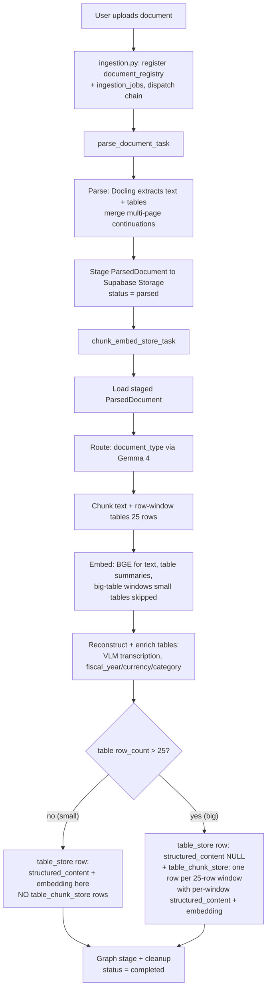
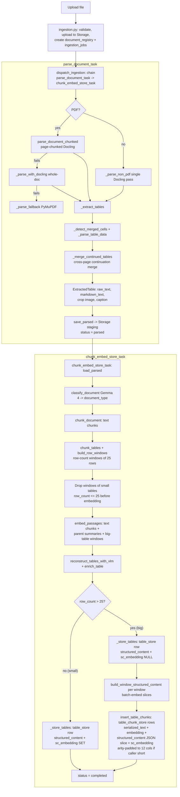
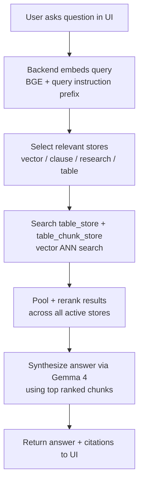
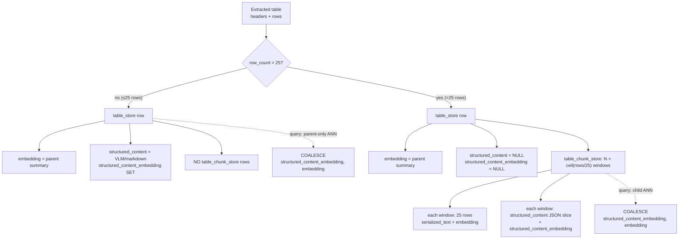
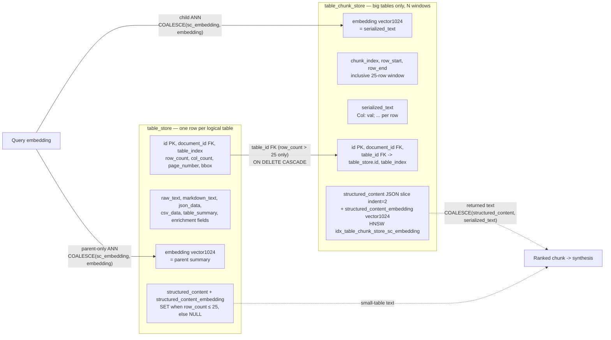

## Diagrams

### Ingestion — high level (staged two-task chain)

### Ingestion — low level

### Retrieval — high level

### Retrieval — low level

```mermaid
flowchart TD
    A[UI submits query] --> A1[Next.js proxy -> POST /api/v1/query]
    A1 --> B[query.py: parse QueryRequest\ntop_k, document_types, table_filters, use_reranker]
    B --> C[embed_query: prefix + BGE 1024-dim vector]

    C --> D{document_types given?}
    D -- no --> D1[classify_intent -> _select_stores]
    D -- yes --> D2[use given types directly]
    D1 --> E[Concurrent per-store queries]
    D2 --> E

    E --> F[_query_table_store]
    F --> F1[Child ANN on COALESCE\nstructured_content_embedding, embedding\ntext = COALESCE structured_content, serialized_text\n+ WHERE status=completed, type/doc/table_filters]
    F1 --> F2[Join table_chunk_store -> table_store -> document_registry]
    F2 --> F3[Dedup per table_id:\nkeep top TABLE_MAX_WINDOWS_PER_QUERY_RESULT]
    F3 --> F5[_query_table_store_parent_only\nANN on COALESCE table_store.sc_embedding, embedding\ncovers small tables + big tables with no child hit]
    F5 --> G[Table store candidate chunks\nbig-table windows + small-table parents]

    G --> H[balanced_pool: cap per-store\nRERANK_PER_STORE_CAP=8]
    H --> I{use_reranker?}
    I -- yes --> I1[rerank: BGE-reranker-large\ntop 40, score 0.3*sigmoid + 0.7*minmax]
    I -- no --> I2[Reciprocal Rank Fusion]
    I1 --> J[Final ranked top_k chunks]
    I2 --> J

    J --> K{relevance below threshold\nor zero chunks?}
    K -- yes --> K1[Fallback: no-results\nor off-topic reply]
    K -- no --> L[_build_context: numbered blocks\ntable chunks include table_markdown]
    L --> Mx[synthesize via Gemma 4]
    Mx -- error --> M1[_fallback: concatenate chunk texts]
    Mx --> Nx[_citation_from_chunk: filename, page,\ntable_markdown, bbox, signed URL]
    K1 --> Nx
    M1 --> Nx
    Nx --> O[Return answer, confidence, sources_used]
```

### `table_store` / `table_chunk_store` internal architecture — high level

Parent/child split driven by table size (`TABLE_CHUNK_MAX_ROWS = 25`).

### `table_store` / `table_chunk_store` internal architecture — low level

